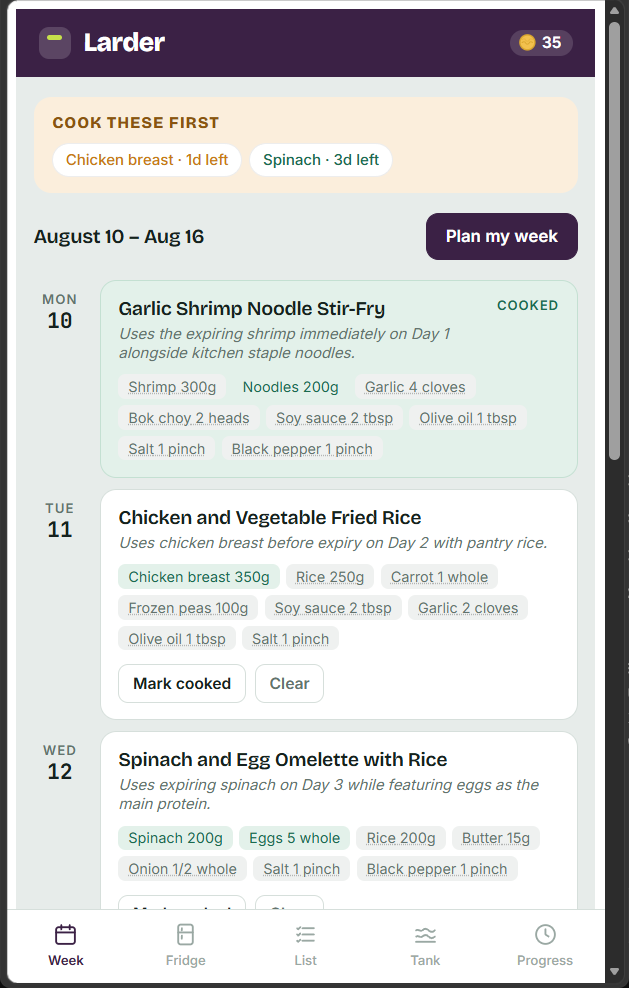
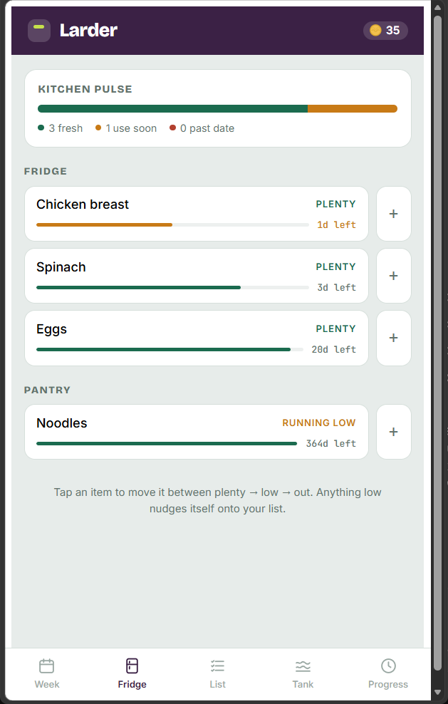
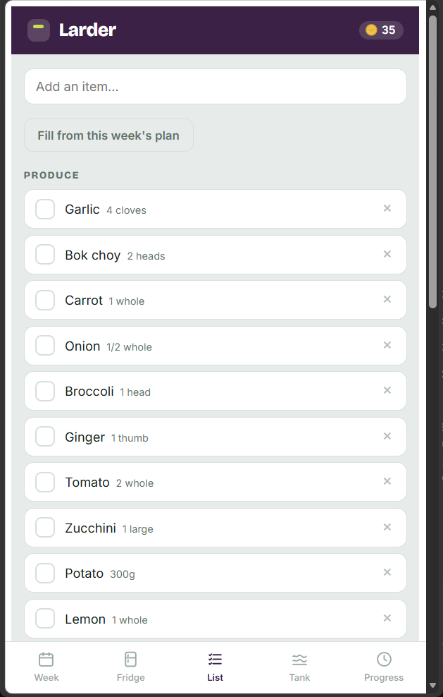
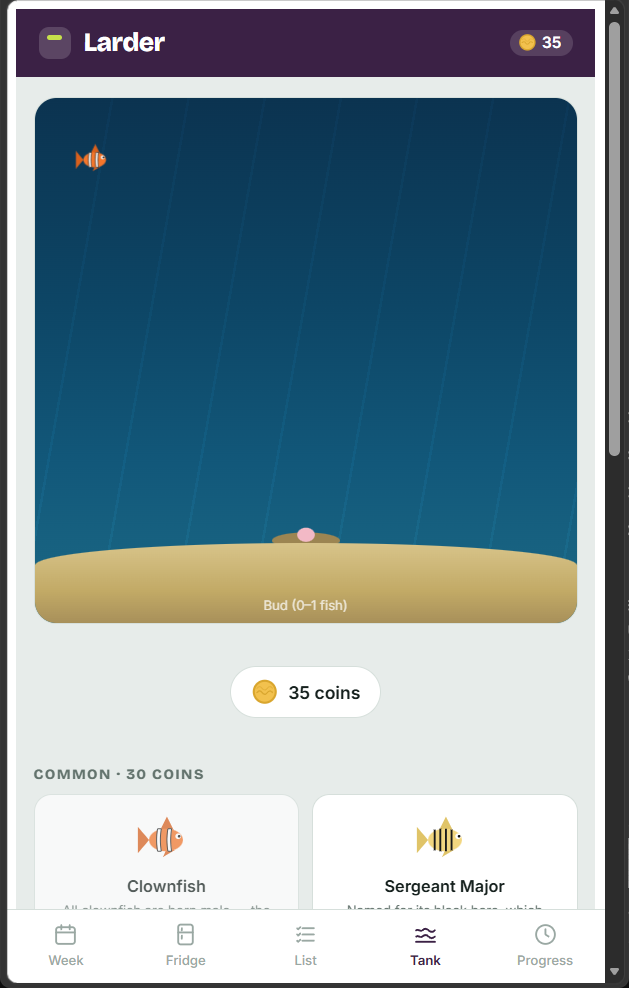
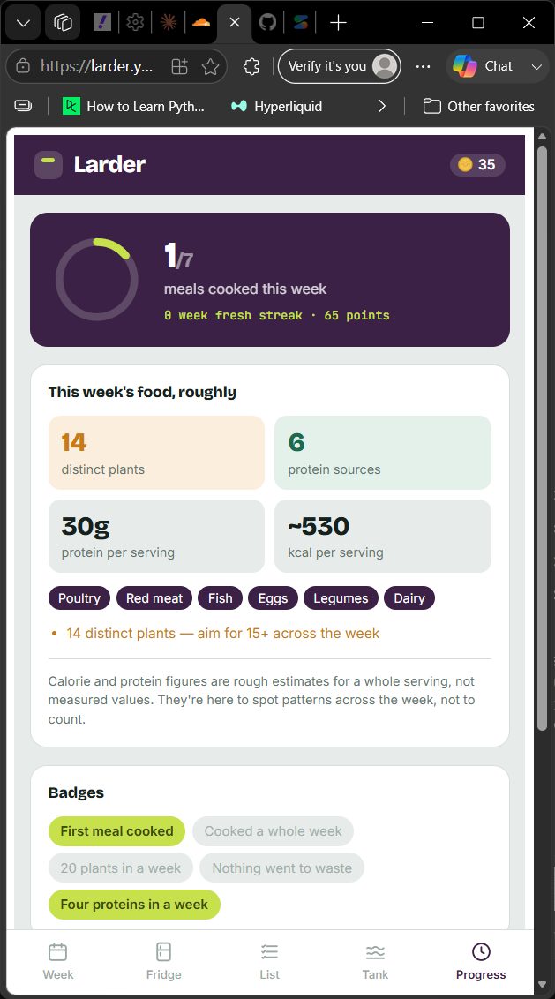

# Larder

Kitchen inventory, meal plan, and shopping list for a two-person household — with a coin economy and an ocean-floor fish tank for encouragement. Built for personal use by two people, not as a product.

Design docs (read these before changing direction, not after):
- `PROJECT.md` — product decisions, MVP scope, data model
- `ARCHITECTURE.md` — why Cloudflare Workers + D1, the PIN/session design, sync
- `GAMIFICATION.md` — coins, the fish catalog, coral growth, ocean-floor dirtiness

## Want to try it?

This is source code, not a public demo — the deployed instance is gated behind a household PIN (see `ARCHITECTURE.md` §7) and isn't meant for strangers to poke at. If you'd like to try it out, [open an issue](../../issues) or reach out to the repo owner ([@rafinika](https://github.com/rafinika)) and ask for a PIN — or just spin up your own copy for free, following "First-time setup" below.

## Screenshots

| Week plan | Fridge | Shopping list |
|---|---|---|
|  |  |  |

| Ocean floor tank | Progress |
|---|---|
|  |  |

Cooking a planned meal earns coins; coins buy fish for the tank. The **Week** view plans meals around what's about to expire, **Fridge** tracks inventory, **List** is the shopping list, **Tank** is the coin-economy reward screen, and **Progress** tracks cooking streaks and nutritional variety for the week.

## What's actually running

One Cloudflare Worker (`worker/index.js`) serves both the built React app (static assets) and a small JSON API, backed by one D1 (SQLite) database holding a single state blob plus a session table. There's no separate backend host, no Node server to keep alive — `wrangler deploy` ships the whole thing.

```
src/            React app (Vite) — this is Larder.jsx, ported to call the API
  App.jsx         main app (was Larder.jsx)
  api.js          talks to the Worker: login, get/put state, LLM proxy
  components/     PinGate (login screen), shared icons
  aquarium/       fish catalog, coral growth, the ocean-floor scene, shop UI
  assets/         the 9 SVG icons (coin + 8 fish) — see "Editing the art" below
worker/
  index.js        the whole API: login, state, LLM proxy
schema.sql      D1 tables — run once per environment
wrangler.toml   Cloudflare config (Worker + D1 binding + static assets)
```

## First-time setup

```bash
npm install
```

**1. Create the D1 database:**
```bash
npx wrangler d1 create larder-db
```
Copy the `database_id` it prints into `wrangler.toml`.

**2. Set the two secrets** (never go in a file — these are set directly on Cloudflare):
```bash
npx wrangler secret put HOUSEHOLD_PIN         # the PIN you and your wife will type
npx wrangler secret put GEMINI_API_KEY        # free tier, from aistudio.google.com/apikey
```
This repo ships with a placeholder PIN (`000000`) wired into `.dev.vars.example` for local dev only — set the real one with the command above before you actually use this day to day.

**3. Apply the schema:**
```bash
npm run db:init            # remote (production) database
npm run db:init:local      # local dev database (for step 4)
```

**4. Local dev** (runs the frontend and the Worker together, proxied so it behaves like production):
```bash
cp .dev.vars.example .dev.vars    # local-only secrets, gitignored
npm run dev
```
Opens the Vite dev server; API calls proxy through to `wrangler dev` on port 8787. Enter the PIN from `.dev.vars` to unlock.

**5. Deploy:**
```bash
npm run deploy
```
Prints a `*.workers.dev` URL. Open it on both phones, enter the real PIN once each, "Add to Home Screen."

## Editing the fish/coin art in the future

Yes — this is genuinely easy to change later, on purpose:

- The 9 icons are plain `.svg` files in `src/assets/` (small, hand-authored — not generated by any tool that needs re-running). Open any of them in a text editor, VS Code, Figma, or Inkscape and edit directly. No build step or regeneration required; whatever's in the file is what renders.
- The actual game data — species name, tier, cost, the one-line fact, and the icon markup used at runtime — lives in one place: `src/aquarium/fishCatalog.js`. To add a 9th species, add an entry to `FISH_CATALOG` (copy an existing SVG's `<path>`/`<circle>` markup into the `svg` field, or paste in a redrawn one). To change a cost or a fact, edit that entry directly. Nothing else needs to change — the shop grid and the ocean-floor scene both read from this one array.
- The coral shape lives in `src/aquarium/coral.js` (`coralInnerSVG`) if you want to redraw the centerpiece itself.
- Since this is now a real git repo, every art change is a normal commit — easy to try something, compare, or revert if it doesn't look right.

The `gamification-assets-preview.html` and `ocean-floor-prototype.html` files from earlier design sessions aren't part of the app (they were standalone mockups) — the real, wired-up version is what's in `src/aquarium/`.

## GitHub

This folder is already a git repo with an initial commit. To connect it to GitHub:

```bash
# On github.com: create a new repository (recommend Private, since this is a
# personal household app) — don't initialize it with a README/license, this
# repo already has one.

git remote add origin https://github.com/<your-username>/<repo-name>.git
git branch -M main
git push -u origin main
```

If you use the GitHub CLI (`gh`) or GitHub Desktop instead, either works fine — this is just a normal git repo, nothing Cloudflare-specific about the git side. From then on, `git push` after any commit keeps GitHub in sync; nothing about deployment depends on GitHub itself (deploying is `npm run deploy`, independent of where the code is hosted). If you want push-to-deploy later (every `git push` triggers `wrangler deploy` automatically), that's a GitHub Actions workflow you can add once the repo exists on GitHub — ask if you want that set up.

## Notes

- No auth beyond the household PIN — see `ARCHITECTURE.md` §7 for the tradeoffs and what "remembered device" means.
- The LLM calls (`/api/llm`) use Google's Interactions API (`POST /v1beta/interactions`) with the `gemini-3.6-flash` model (free tier) — swapped from the original Anthropic Claude call to avoid paid API usage.
- `PROJECT.md` §6 lists what's deliberately not built yet (multi-device sync was the big one — now done — lunch/breakfast rows, editable shelf-life defaults, etc. are still open).
